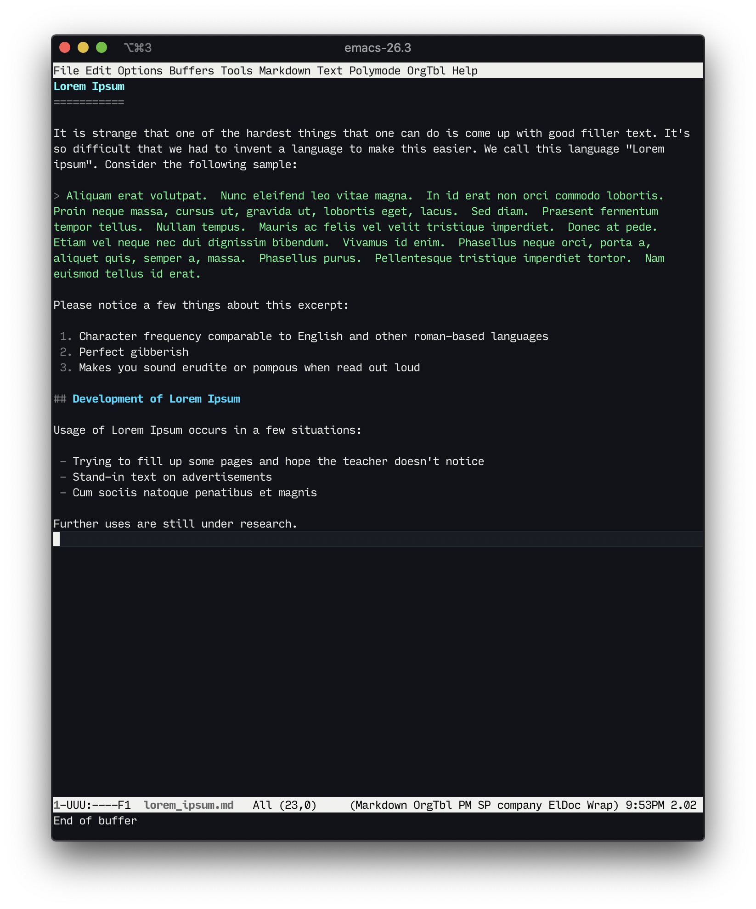
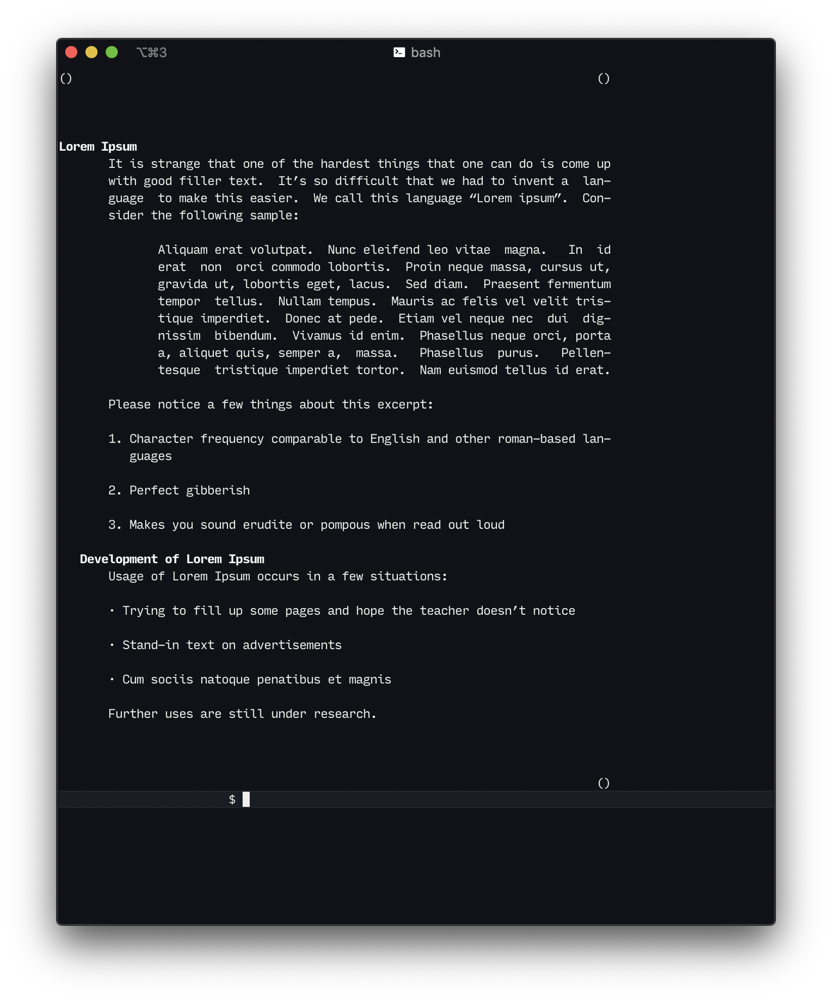

Marked Man
==========

View Markdown files as `man` pages.

Get you some markdown:



Read it:



* * *

This is a simple one liner:

```bash
pandoc -s -t man "$1" | groff -T utf8 -man | $PAGER
```

Usage:

```
$ mm README.md
```

Installation
------------

You will need:

 - [Pandoc](http://pandoc.org)
 - groff

For macOS users, groff should come pre-installed. You can get Pandoc via [brew](https://brew.sh):

```
$ brew install pandoc
```

After that, put the file `mm` somewhere in your `$PATH`

Credits
-------

Thanks to all who helped [here](https://stackoverflow.com/questions/51544667/how-do-i-view-markdown-file-like-a-man-page-without-making-a-temporary-file)! (Really, thanks [L. Scott Johnson](https://stackoverflow.com/users/2183547/l-scott-johnson)! He made this. I just put it in a Git repo.)

Author
------

Ashton Wiersdorf

